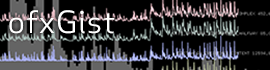

# ofxGist
openFrameworks implementation of GIST real-time sound analysis library

An openFrameworks implementation of Adam Stark's real-time sound analysis library Gist

https://github.com/adamstark/Gist

NOTE UPDATE May 25, 2015
No dependencies, but the example makes us of a modified
[ofxOpenALSoundPlayer](https://github.com/borg/ofxOpenALSoundPlayer). It is included only as a way of getting buffer out of loaded sound. There are many other ways you can do that. This player includes a version of kissFFT. You can remove the one included in Gist.

Also using a slightly modified  [ofxHistoryPlot](https://github.com/local-projects/ofxHistoryPlot) from @armadillu to add a dynamic getVariable method to be able to plot based on gist feature list

by
/Andreas Borg

From [Gist page](http://www.adamstark.co.uk/gist/)

Gist

Gist is a C++ audio analysis library intended for use in real-time applications. It contains a range of audio analysis algorithms, including:

* Simple Time Domain Features (e.g. RMS, Zero Crossing Rate)
* Simple Frequency Domain Features (e.g. Spectral Centroid, Spectral Flatness)
* Onset Detection Functions (e.g. Energy Difference, Complex Spectral Difference)
* Pitch Detection
* Mel-frequency Representations (e.g. Mel-frequency Spectrum, MFCCs)

